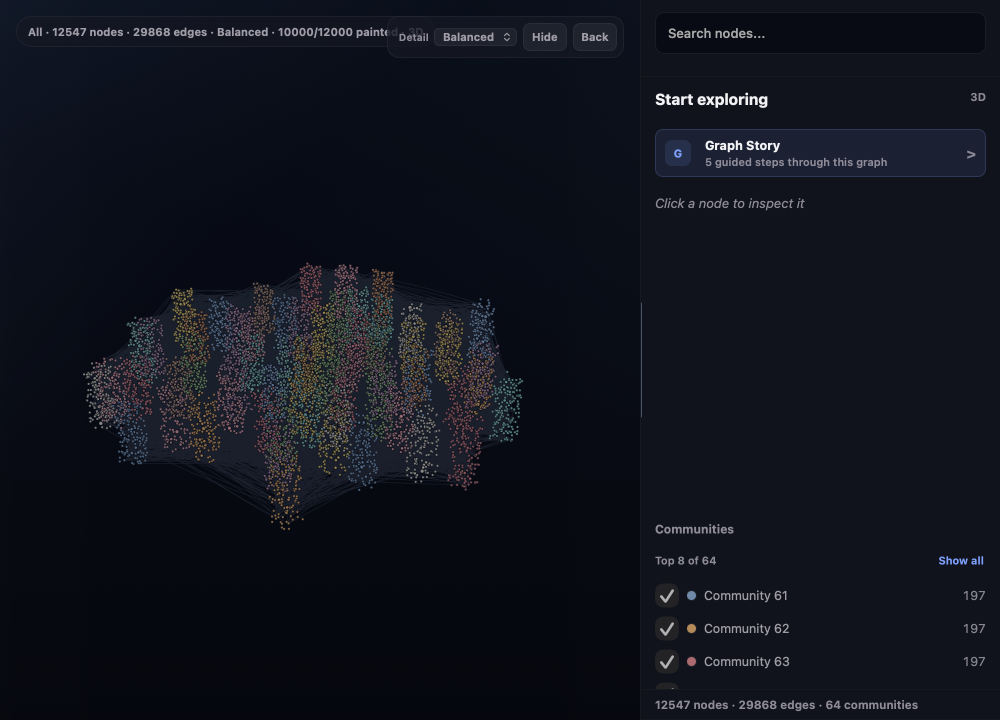
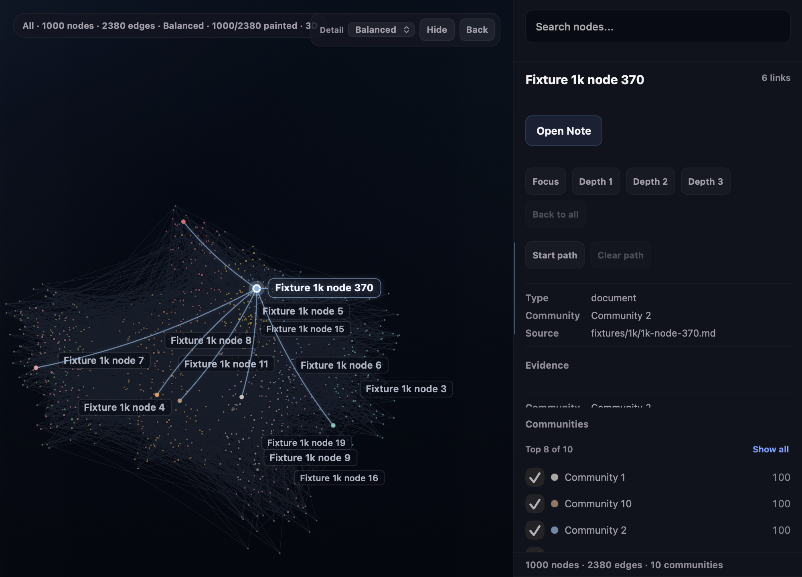

# BrainBar

> Explore large Markdown knowledge graphs on macOS without sending your vault anywhere.

[](https://github.com/roccodaffuso/brain-bar/releases/latest)
[](https://www.apple.com/macos/)
[](https://github.com/roccodaffuso/brain-bar/releases/latest)
[](https://github.com/safishamsi/graphify)
[](LICENSE)

BrainBar turns local [Graphify](https://github.com/safishamsi/graphify) output into a native macOS workspace for exploring a second brain, documentation vault, or any Graphify-compatible Markdown graph.

Search for a note. Orbit its neighborhood in 3D. Trace why two ideas connect. Review what changed. See metadata-only agent activity appear on the graph. Your Markdown remains canonical and local.

**[Download the latest notarized DMG](https://github.com/roccodaffuso/brain-bar/releases/latest)** · [What changed in v0.10.0](CHANGELOG.md#0100---2026-08-09) · [Configuration](docs/configuration.md)



*Public-safe synthetic fixture: 12,547 nodes and 29,868 edges in the perspective 3D Explorer.*

## Why BrainBar

Large Markdown graphs are useful, but they become difficult to read once thousands of notes and relationships share one canvas. BrainBar adds the interaction layer that generated graph files do not provide on their own:

- **Stay oriented.** Perspective community islands, progressive detail, semantic camera views, and saved graph contexts keep large graphs navigable.
- **Follow relationships.** Search Reveal, Source Lens, shortest paths, path explanations, and edge provenance expose how notes connect.
- **Resume where the graph changed.** Recent Orbit, Graph Story, Change Radar, Agent Activity, and explicit workflow trails turn the graph into a working surface.
- **Inspect without mutating.** Graph Check and evidence inspectors explain maintenance opportunities but never rewrite Markdown.

BrainBar does not generate the graph itself. Graphify remains the derived-graph layer; Markdown remains the source of truth.

```text
Markdown vault
    │
    └── Graphify ──> graphify-out/graph.json
                         │
                         ├── BrainBar 3D Explorer
                         └── BrainBar 2D Workbench  (when graph.html exists)
```

## Quick Start

### Requirements

- macOS 14 or newer
- a local Markdown vault or content directory
- Graphify output containing `graphify-out/graph.json`

### 1. Generate the graph

Install [Graphify](https://github.com/safishamsi/graphify), then run it from your vault:

```sh
cd /path/to/your/vault
graphify update .
```

### 2. Install BrainBar

Download `BrainBar.dmg` from the [latest release](https://github.com/roccodaffuso/brain-bar/releases/latest), or use the installer:

```sh
curl -fsSL https://raw.githubusercontent.com/roccodaffuso/brain-bar/main/install.sh | bash
```

To prefill the vault path:

```sh
BRAIN_BAR_VAULT_PATH="/path/to/your/vault" \
  curl -fsSL https://raw.githubusercontent.com/roccodaffuso/brain-bar/main/install.sh | bash
```

### 3. Open the graph

1. Open BrainBar from `~/Applications`.
2. Choose the vault in Settings.
3. Refresh status.
4. Open the Focus Window and start in 3D.

BrainBar preserves the existing local configuration when updated.

## Explore the Graph

### 3D Explorer

The 3D Explorer is the main large-graph surface. It uses deterministic community-island coordinates, a perspective camera, and adaptive painted detail while keeping every valid graph identity searchable and queryable.

- orbit, pan, dolly, Fit, Top View, and Reset Tilt
- Overview, Balanced, and Full painted detail
- Search Reveal and node-focused camera views
- Focus depth from immediate neighbors to wider context
- Community Spotlight and source-aware filtering
- shortest path, alternative paths, and deterministic explanations
- Recent Orbit and guided Graph Story
- Collapsed, Overlay, and Docked context panels
- reduced-motion and keyboard-accessible controls



*Selecting a node keeps its surrounding community visible while exposing source, relationship, and graph-health evidence.*

### 2D Workbench

The 2D Workbench is the dense operational view for graph hygiene, provenance inspection, and workflow lenses. BrainBar supplies a pinned local Vis Network 9.1.6 runtime, so viewing a generated `graph.html` does not depend on a remote CDN.

Use it for:

- Recent, Key Notes, Needs Links, Groups, Review, and Graph Check views
- All, Graphify, and Wikilinks source lenses
- edge direction, relationship, provenance, and source-path inspection
- Reveal in 3D and Path from here in 3D

| Graphify output | 3D Explorer | 2D Workbench |
| --- | --- | --- |
| `graph.json` | Yes | No |
| `graph.json` + `graph.html` | Yes | Yes |

If a large graph exceeds Graphify's HTML visualization limit, BrainBar still opens the JSON-only graph in 3D.

## Understand What Changed

BrainBar adds local context around the graph without turning derived observations into canonical truth.

### Change Radar

After a successful refresh, Change Radar compares bounded local snapshots and surfaces added, removed, changed, and newly attention-worthy graph entities in a compact Change Inbox.

### Agent Activity

Agent Activity watches local filesystem metadata and can consume events from the bundled `brainbar-trace` helper. Optional one-click integrations are available for Codex and Claude.

Events can describe `read`, `write`, `create`, `delete`, `focus`, `closeout`, and `decision` actions. BrainBar maps safe relative paths back to graph nodes when possible and keeps unresolved paths pending until Graphify refreshes the graph.


### Workflows

Workflow history groups activity only when an explicit workflow or session identifier exists. Source, output, touched-note trails, graph highlights, retention, and Clear behavior remain local and inspectable.

### Guided Maintenance

Node and edge inspectors share one deterministic evidence engine across 2D and 3D. Graph Check can surface orphans, isolated components, stale hubs, weak bridges, and related caveats as copy-only proposals. It exposes no graph-to-Markdown mutation action.

## Local-First Boundary

| BrainBar does | BrainBar does not |
| --- | --- |
| Read local Graphify output | Upload vault contents |
| Open local source notes through macOS | Call remote AI services |
| Store config, caches, views, Radar, and activity history in Application Support | Store prompts, raw transcripts, stdout, stderr, or note bodies in Agent Activity |
| Run commands you explicitly configure | Rewrite Markdown from graph exploration |
| Run Graphify when you explicitly request a refresh | Modify generated Graphify files merely by viewing the graph |

Default local state lives under:

```text
~/Library/Application Support/BrainBar/
```

Agent Activity retention is bounded and configurable. Change Radar and workflow history are vault-scoped. See [Agent Workflows](docs/agent-workflows.md) for the full metadata and privacy boundary.

## What Ships in v0.10.0

- perspective 3D community islands with adaptive detail and Retina node rendering
- off-main graph validation, Worker layout, cancellation, retry, and deterministic layout caching
- offline 2D runtime for Graphify-generated `graph.html`
- Setup Doctor, global filtered search, saved views, and versioned 2D/3D continuity
- Change Radar and a deterministic Change Inbox
- privacy-bounded Agent Activity and explicit-ID workflow trails
- shared 2D/3D evidence inspectors and read-only Guided Maintenance
- Developer ID signed and Apple-notarized GitHub releases

The full technical history is in [CHANGELOG.md](CHANGELOG.md).

## Configuration

The default configuration file is:

```text
~/Library/Application Support/BrainBar/config.json
```

Installer options:

- `BRAIN_BAR_VAULT_PATH`: prefill the configured vault path
- `BRAIN_BAR_FORCE=1`: replace an existing installation without prompting
- `BRAIN_BAR_INSTALL_DIR`: change the install directory from `~/Applications`

BrainBar can run configured local commands for Graphify refresh, Brain Check, Review Queue status, and explicit manual actions. It does not own those workflows and never runs a mutating Review Queue action automatically.

See [docs/configuration.md](docs/configuration.md) for the complete config shape.

## Update or Uninstall

Update by running the installer again:

```sh
BRAIN_BAR_FORCE=1 \
  curl -fsSL https://raw.githubusercontent.com/roccodaffuso/brain-bar/main/install.sh | bash
```

Uninstall the app while keeping local configuration:

```sh
curl -fsSL https://raw.githubusercontent.com/roccodaffuso/brain-bar/main/uninstall.sh | bash
```

Remove the local configuration too:

```sh
BRAIN_BAR_REMOVE_CONFIG=1 \
  curl -fsSL https://raw.githubusercontent.com/roccodaffuso/brain-bar/main/uninstall.sh | bash
```

## Troubleshooting

- **The graph is empty:** confirm the configured vault and `graphify-out/graph.json`, then refresh status.
- **Only 3D is available:** 2D additionally requires `graphify-out/graph.html`; JSON-only graphs are fully supported in 3D.
- **Refresh fails:** make sure `graphify` is on `PATH`, or configure its absolute executable path.
- **A new file appears as pending activity:** refresh Graphify so the path can resolve to a graph node.
- **Search or paths omit expected nodes:** check the active Source Lens and community filters.
- **macOS blocks an old build:** replace it with the latest notarized DMG.

## Development

Requirements: Xcode 16 or newer and Node.js.

```sh
xcodebuild -project BrainBar.xcodeproj \
  -scheme BrainBar \
  -destination 'platform=macOS' \
  build

xcodebuild test \
  -project BrainBar.xcodeproj \
  -scheme BrainBar \
  -destination 'platform=macOS'

node scripts/test-graph-runtime.mjs
bash scripts/check-public-safety.sh
```

The CI workflow also runs deterministic large-graph, evidence, layout, presentation, visual-acceptance, accessibility, and memory-evidence checks. See [Performance Testing](docs/performance-testing.md) for the reference fixtures and measurement boundary.

Before changing product vocabulary or architecture terms, read [CONCEPTS.md](CONCEPTS.md).

## Release Process

Maintainer tags run public-safety checks, JavaScript gates, the full XCTest suite, Developer ID signing, Apple notarization, stapling, DMG creation, and mounted-app validation before publication.

See [RELEASING.md](RELEASING.md) for the release contract and post-release verification workflow.

## Documentation

- [Concepts and product vocabulary](CONCEPTS.md)
- [Configuration](docs/configuration.md)
- [Agent Workflows](docs/agent-workflows.md)
- [3D visual and spatial redesign](docs/graph3d-visual-spatial-redesign.md)
- [3D presentation acceptance](docs/graph3d-presentation-acceptance.md)
- [Accessibility audit](docs/graph3d-accessibility-audit.md)
- [Performance testing](docs/performance-testing.md)

## License

MIT. See [LICENSE](LICENSE).
